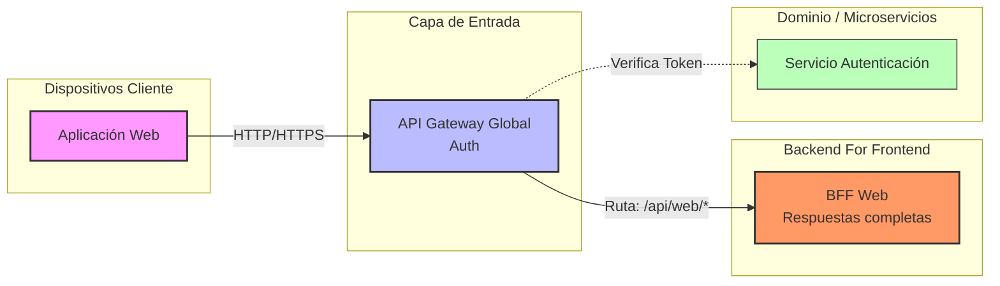

```mermaid
flowchart LR
 subgraph Clientes["Dispositivos Cliente"]
        WebApp["Aplicación Web"]
  end
 subgraph Entrada["Capa de Entrada"]
        Gateway["API Gateway Global<br> Auth"]
  end
 subgraph CapaBFF["Backend For Frontend"]
        BFF_Web["BFF Web<br> Respuestas completas"]
  end
 subgraph Microservicios["Dominio / Microservicios"]
        MS_Auth["Servicio Autenticación"]
  end
    WebApp -- HTTP/HTTPS --> Gateway
    Gateway -. Verifica Token .-> MS_Auth
    Gateway -- Ruta: /api/web/* --> BFF_Web

     WebApp:::client
     Gateway:::gateway
     BFF_Web:::bff
     MS_Auth:::ms
    classDef client fill:#f9f,stroke:#333,stroke-width:2px
    classDef gateway fill:#bbf,stroke:#333,stroke-width:2px
    classDef bff fill:#f96,stroke:#333,stroke-width:2px
    classDef ms fill:#bfb,stroke:#333,stroke-width:1px
```