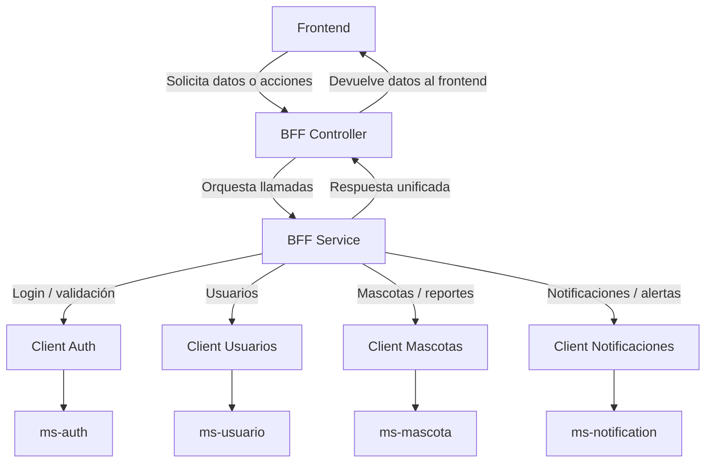

```mermaid
flowchart TB
    FE[Frontend] -->|Solicita datos o acciones| BFFController[BFF Controller]
    BFFController -->|Orquesta llamadas| BFFService[BFF Service]

    BFFService -->|Login / validación| AuthClient[Client Auth]
    BFFService -->|Usuarios| UserClient[Client Usuarios]
    BFFService -->|Mascotas / reportes| PetClient[Client Mascotas]
    BFFService -->|Notificaciones / alertas| NotificationClient[Client Notificaciones]

    AuthClient --> AUTH[ms-auth]
    UserClient --> USER[ms-usuario]
    PetClient --> PET[ms-mascota]
    NotificationClient --> NOTIF[ms-notification]

    BFFService -->|Respuesta unificada| BFFController
    BFFController -->|Devuelve datos al frontend| FE
```    
