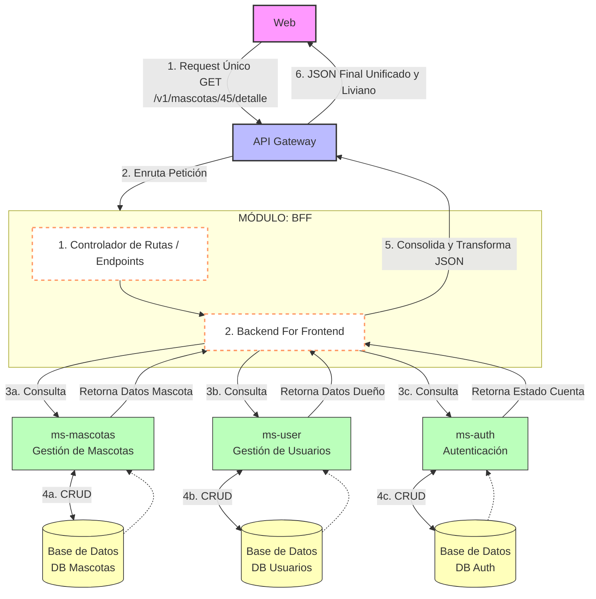

```mermaid
graph TD
    %% Estilos de los Nodos
    classDef client fill:#f9f,stroke:#333,stroke-width:2px;
    classDef gateway fill:#bbf,stroke:#333,stroke-width:2px;
    classDef bff fill:#f96,stroke:#333,stroke-width:2px;
    classDef ms fill:#bfb,stroke:#333,stroke-width:1px;
    classDef db fill:#ffb,stroke:#333,stroke-width:1px;
    classDef bff_int fill:#fff,stroke:#f96,stroke-width:2px,stroke-dasharray: 5 5;

    %% Cliente y Gateway externo
    Client[Web]:::client -->|1. Request Único <br> GET /v1/mascotas/45/detalle| Gateway[API Gateway]:::gateway
    Gateway -->|2. Enruta Petición| BFF_Box

    %% ZOOM INTERNO AL BFF
    subgraph BFF_Box [MÓDULO: BFF ]
        Direction[1. Controlador de Rutas / Endpoints]:::bff_int
        Orchestrator[2. Backend For Frontend]:::bff_int
        
        Direction --> Orchestrator
    end

    %% Llamadas concurrentes desde el BFF a los Microservicios
    Orchestrator -->|3a. Consulta| MS_Mascotas[ms-mascotas <br> Gestión de Mascotas]:::ms
    Orchestrator -->|3b. Consulta| MS_User[ms-user <br> Gestión de Usuarios]:::ms
    Orchestrator -->|3c. Consulta| MS_Auth[ms-auth <br> Autenticación]:::ms

    %% Cada microservicio con su Base de Datos Independiente (Database per Service)
    MS_Mascotas <-->|4a. CRUD| DB_Mascotas[(Base de Datos <br> DB Mascotas)]:::db
    MS_User <-->|4b. CRUD| DB_User[(Base de Datos <br> DB Usuarios)]:::db
    MS_Auth <-->|4c. CRUD| DB_Auth[(Base de Datos <br> DB Auth)]:::db

    %% Respuestas independientes que vuelven al BFF para ser unificadas
    DB_Mascotas -.-> MS_Mascotas -->|Retorna Datos Mascota| Orchestrator
    DB_User -.-> MS_User -->|Retorna Datos Dueño| Orchestrator
    DB_Auth -.-> MS_Auth -->|Retorna Estado Cuenta| Orchestrator

    %% Respuesta optimizada de salida desde el BFF
    Orchestrator -->|5. Consolida y Transforma JSON| Gateway
    Gateway -->|6. JSON Final Unificado y Liviano| Client
```    
