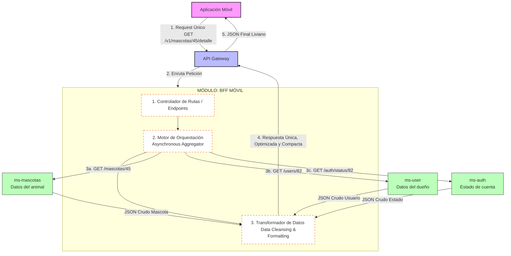

```mermaid
graph TD
    %% Estilos de los Nodos
    classDef client fill:#f9f,stroke:#333,stroke-width:2px;
    classDef gateway fill:#bbf,stroke:#333,stroke-width:2px;
    classDef bff fill:#f96,stroke:#333,stroke-width:2px;
    classDef ms fill:#bfb,stroke:#333,stroke-width:1px;
    classDef bff_int fill:#fff,stroke:#f96,stroke-width:2px,stroke-dasharray: 5 5;

    %% Cliente y Gateway externo
    Client[Aplicación Móvil]:::client -->|1. Request Único <br> GET /v1/mascotas/45/detalle| Gateway[API Gateway]:::gateway
    Gateway -->|2. Enruta Petición| BFF_Box

    %% ZOOM INTERNO AL BFF
    subgraph BFF_Box [MÓDULO: BFF MÓVIL]
        Direction[1. Controlador de Rutas / Endpoints]:::bff_int
        Orchestrator[2. Motor de Orquestación <br> Asynchronous Aggregator]:::bff_int
        Transformer[3. Transformador de Datos <br> Data Cleansing & Formatting]:::bff_int
        
        Direction --> Orchestrator
        Orchestrator --> Transformer
    end

    %% Llamadas concurrentes internas (Red local de alta velocidad)
    Orchestrator -->|3a. GET /mascotas/45| MS_Mascotas[ms-mascotas <br> Datos del animal]:::ms
    Orchestrator -->|3b. GET /users/82| MS_User[ms-user <br> Datos del dueño]:::ms
    Orchestrator -->|3c. GET /auth/status/82| MS_Auth[ms-auth <br> Estado de cuenta]:::ms

    %% Respuestas crudas que vuelven al BFF
    MS_Mascotas -->|JSON Crudo Mascota| Transformer
    MS_User -->|JSON Crudo Usuario| Transformer
    MS_Auth -->|JSON Crudo Estado| Transformer

    %% Respuesta optimizada de salida
    Transformer -->|4. Respuesta Única, Optimizada y Compacta| Gateway
    Gateway -->|5. JSON Final Liviano| Client
```    