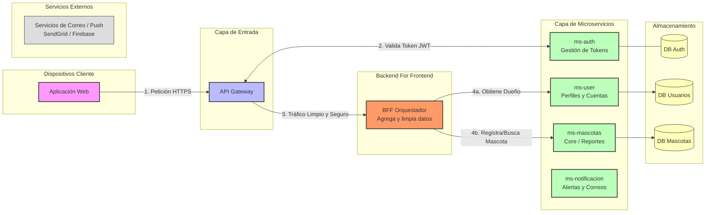

```mermaid

flowchart LR
 subgraph Clientes["Dispositivos Cliente"]
        App["Aplicación Web"]
  end
 subgraph Entrada["Capa de Entrada"]
        Gateway["API Gateway"]
  end
 subgraph CapaBFF["Backend For Frontend"]
        BFF["BFF Orquestador<br> Agrega y limpia datos"]
  end
 subgraph Servicios["Capa de Microservicios"]
        MS_Auth["ms-auth<br> Gestión de Tokens"]
        MS_User["ms-user<br> Perfiles y Cuentas"]
        MS_Mascotas["ms-mascotas<br> Core / Reportes"]
        MS_Notif["ms-notificacion<br> Alertas y Correos"]
  end
 subgraph Persistencia["Almacenamiento"]
        DB_Auth[("DB Auth")]
        DB_User[("DB Usuarios")]
        DB_Mascotas[("DB Mascotas")]
  end
 subgraph Externos["Servicios Externos"]
        SMTP["Servicios de Correo / Push<br> SendGrid / Firebase"]
  end
    App -- "1. Petición HTTPS" --> Gateway
    Gateway <-- "2. Valida Token JWT" --> MS_Auth
    MS_Auth --- DB_Auth
    Gateway -- "3. Tráfico Limpio y Seguro" --> BFF
    BFF -- "4a. Obtiene Dueño" --> MS_User
    BFF -- "4b. Registra/Busca Mascota" --> MS_Mascotas
    MS_User --> DB_User
    MS_Mascotas --> DB_Mascotas

     App:::client
     Gateway:::gateway
     BFF:::bff
     MS_Auth:::ms
     MS_User:::ms
     MS_Mascotas:::ms
     MS_Notif:::ms
     DB_Auth:::db
     DB_User:::db
     DB_Mascotas:::db
     SMTP:::ext
    classDef client fill:#f9f,stroke:#333,stroke-width:2px
    classDef gateway fill:#bbf,stroke:#333,stroke-width:2px
    classDef bff fill:#f96,stroke:#333,stroke-width:2px
    classDef ms fill:#bfb,stroke:#333,stroke-width:2px
    classDef db fill:#ffb,stroke:#333,stroke-width:1px
    classDef broker fill:#fbb,stroke:#333,stroke-width:2px
    classDef ext fill:#ddd,stroke:#333,stroke-width:1px 
```
