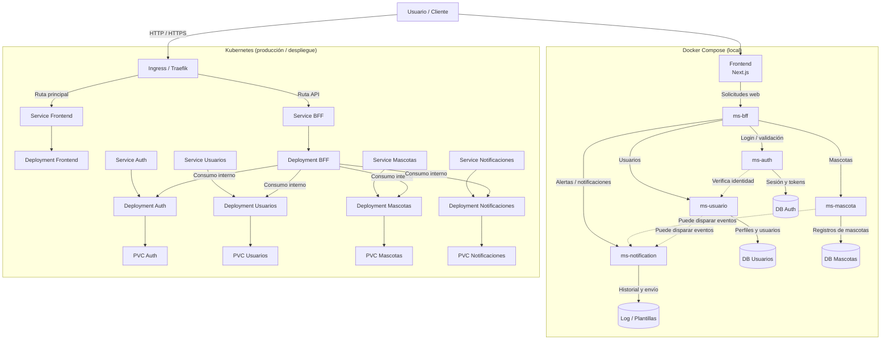

```mermaid
flowchart TB
    U[Usuario / Cliente] --> FE[Frontend<br/>Next.js]

    subgraph DockerCompose["Docker Compose (local)"]
        FE
        BFF[ms-bff]
        AUTH[ms-auth]
        USER[ms-usuario]
        PET[ms-mascota]
        NOTIF[ms-notification]

        DB1[(DB Auth)]
        DB2[(DB Usuarios)]
        DB3[(DB Mascotas)]
        DB4[(Log / Plantillas)]
    end

    FE -->|Solicitudes web| BFF

    BFF -->|Login / validación| AUTH
    BFF -->|Usuarios| USER
    BFF -->|Mascotas| PET
    BFF -->|Alertas / notificaciones| NOTIF

    AUTH -->|Sesión y tokens| DB1
    USER -->|Perfiles y usuarios| DB2
    PET -->|Registros de mascotas| DB3
    NOTIF -->|Historial y envío| DB4

    AUTH -.->|Verifica identidad| USER
    PET -.->|Puede disparar eventos| NOTIF
    USER -.->|Puede disparar eventos| NOTIF

    subgraph Kubernetes["Kubernetes (producción / despliegue)"]
        INGRESS[Ingress / Traefik]
        DEP_FE[Deployment Frontend]
        DEP_BFF[Deployment BFF]
        DEP_AUTH[Deployment Auth]
        DEP_USER[Deployment Usuarios]
        DEP_PET[Deployment Mascotas]
        DEP_NOTIF[Deployment Notificaciones]

        SVC_FE[Service Frontend]
        SVC_BFF[Service BFF]
        SVC_AUTH[Service Auth]
        SVC_USER[Service Usuarios]
        SVC_PET[Service Mascotas]
        SVC_NOTIF[Service Notificaciones]

        PVC1[PVC Auth]
        PVC2[PVC Usuarios]
        PVC3[PVC Mascotas]
        PVC4[PVC Notificaciones]
    end

    U -->|HTTP / HTTPS| INGRESS
    INGRESS -->|Ruta principal| SVC_FE
    INGRESS -->|Ruta API| SVC_BFF

    SVC_FE --> DEP_FE
    SVC_BFF --> DEP_BFF
    SVC_AUTH --> DEP_AUTH
    SVC_USER --> DEP_USER
    SVC_PET --> DEP_PET
    SVC_NOTIF --> DEP_NOTIF

    DEP_BFF -->|Consumo interno| DEP_AUTH
    DEP_BFF -->|Consumo interno| DEP_USER
    DEP_BFF -->|Consumo interno| DEP_PET
    DEP_BFF -->|Consumo interno| DEP_NOTIF

    DEP_AUTH --> PVC1
    DEP_USER --> PVC2
    DEP_PET --> PVC3
    DEP_NOTIF --> PVC4
```
