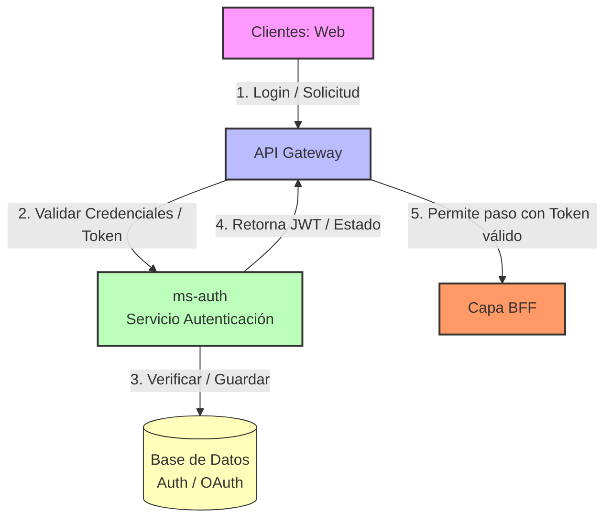

```mermaid
graph TD
    classDef client fill:#f9f,stroke:#333,stroke-width:2px;
    classDef gateway fill:#bbf,stroke:#333,stroke-width:2px;
    classDef bff fill:#f96,stroke:#333,stroke-width:2px;
    classDef ms fill:#bfb,stroke:#333,stroke-width:2px;
    classDef db fill:#ffb,stroke:#333,stroke-width:1px;

    Client[Clientes: Web]:::client -->|1. Login / Solicitud| Gateway[API Gateway]:::gateway
    
    %% Intercepción de Seguridad
    Gateway -->|2. Validar Credenciales / Token| MS_Auth[ms-auth <br> Servicio Autenticación]:::ms
    MS_Auth -->|3. Verificar / Guardar| DB_Auth[(Base de Datos <br> Auth / OAuth)]:::db
    
    %% Respuesta
    MS_Auth -->|4. Retorna JWT / Estado| Gateway
    Gateway -->|5. Permite paso con Token válido| BFF[Capa BFF]:::bff
```