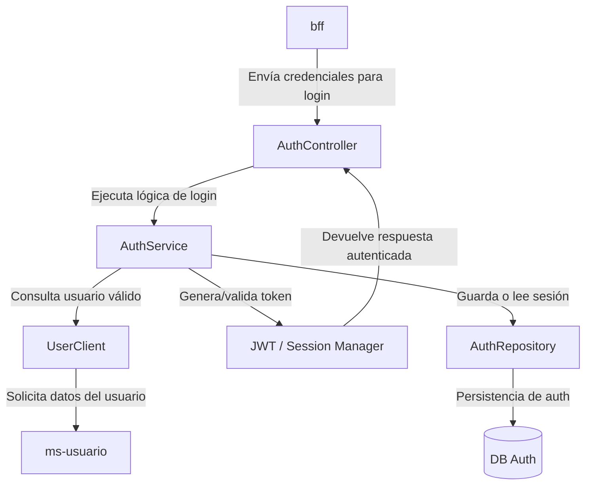

```mermaid
flowchart TB
    BFF[bff] -->|Envía credenciales para login| AuthController[AuthController]
    AuthController -->|Ejecuta lógica de login| AuthService[AuthService]
    AuthService -->|Consulta usuario válido| UserClient[UserClient]
    AuthService -->|Genera/valida token| TokenManager[JWT / Session Manager]
    AuthService -->|Guarda o lee sesión| AuthRepo[AuthRepository]

    UserClient -->|Solicita datos del usuario| USER[ms-usuario]
    AuthRepo -->|Persistencia de auth| DB_AUTH[(DB Auth)]
    TokenManager -->|Devuelve respuesta autenticada| AuthController
```