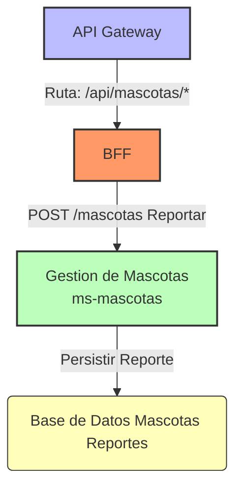

```mermaid
graph TD
    classDef gateway fill:#bbf,stroke:#333,stroke-width:2px;
    classDef bff fill:#f96,stroke:#333,stroke-width:2px;
    classDef ms fill:#bfb,stroke:#333,stroke-width:2px;
    classDef db fill:#ffb,stroke:#333,stroke-width:1px;
    classDef broker fill:#fbb,stroke:#333,stroke-width:2px;

    Gateway["API Gateway"]:::gateway -->|Ruta: /api/mascotas/*| BFF["BFF"]:::bff
    
    %% Flujo Interno
    BFF -->|POST /mascotas Reportar| MS_Mascotas["Gestion de Mascotas
    ms-mascotas"]:::ms
    MS_Mascotas -->|Persistir Reporte| DB_Mascotas("Base de Datos Mascotas Reportes"):::db
```
