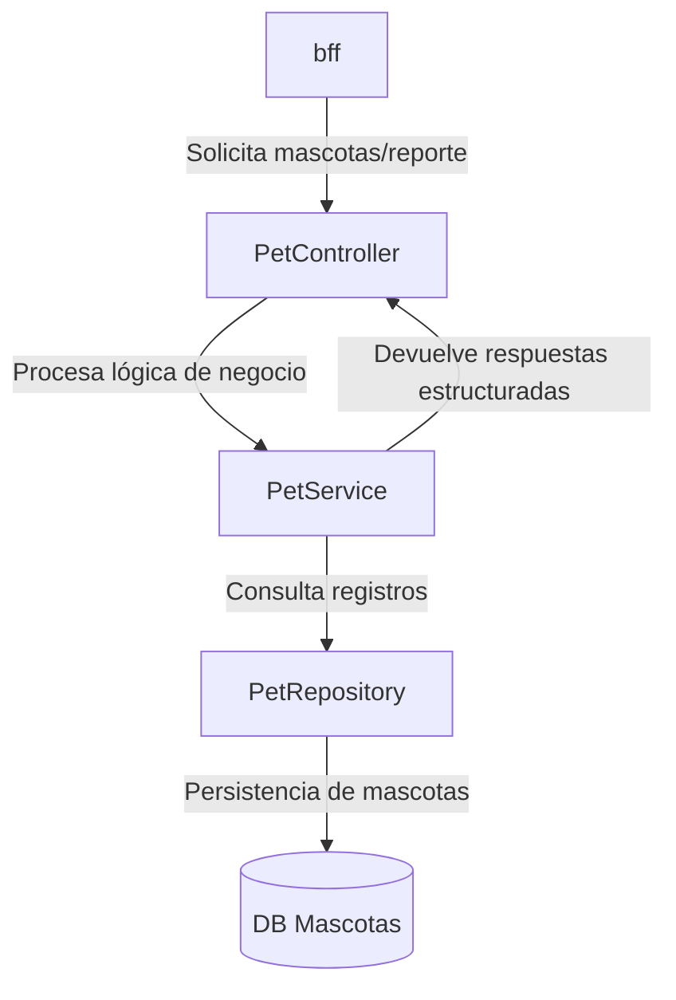

```mermaid
flowchart TB
    BFF[bff] -->|Solicita mascotas/reporte| PetController[PetController]
    PetController -->|Procesa lógica de negocio| PetService[PetService]
    PetService -->|Consulta registros| PetRepo[PetRepository]
    PetRepo -->|Persistencia de mascotas| DB_PET[(DB Mascotas)]
    PetService -->|Devuelve respuestas estructuradas| PetController
```
