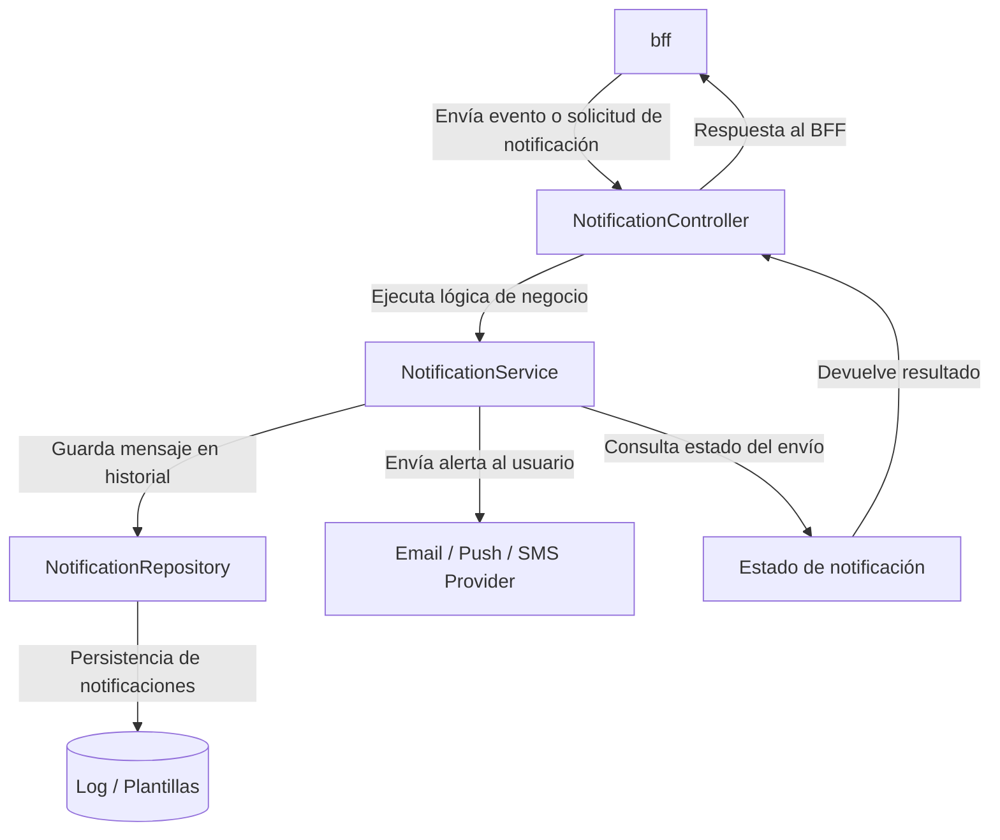

```mermaid
flowchart TB
    BFF[bff] -->|Envía evento o solicitud de notificación| NotifController[NotificationController]
    NotifController -->|Ejecuta lógica de negocio| NotifService[NotificationService]

    NotifService -->|Guarda mensaje en historial| NotifRepo[NotificationRepository]
    NotifService -->|Envía alerta al usuario| EmailSender[Email / Push / SMS Provider]
    NotifService -->|Consulta estado del envío| NotificationStatus[Estado de notificación]

    NotifRepo -->|Persistencia de notificaciones| DBNotif[(Log / Plantillas)]

    NotificationStatus -->|Devuelve resultado| NotifController
    NotifController -->|Respuesta al BFF| BFF
```
