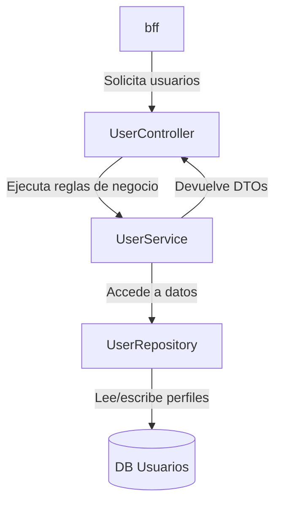

```mermaid
flowchart TB
    BFF[bff] -->|Solicita usuarios| UserController[UserController]
    UserController -->|Ejecuta reglas de negocio| UserService[UserService]
    UserService -->|Accede a datos| UserRepo[UserRepository]
    UserRepo -->|Lee/escribe perfiles| DB_USER[(DB Usuarios)]
    UserService -->|Devuelve DTOs| UserController
```