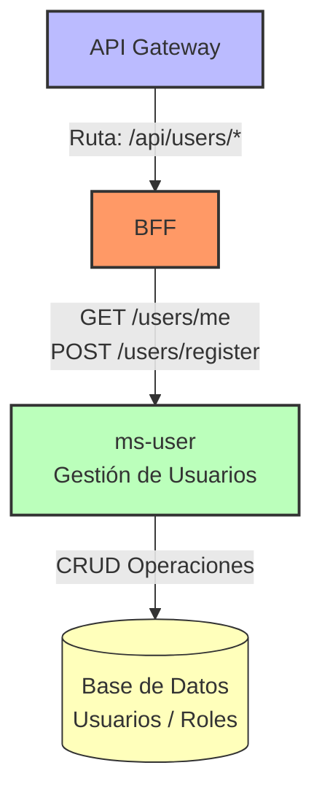

```mermaid
graph TD
    classDef gateway fill:#bbf,stroke:#333,stroke-width:2px;
    classDef bff fill:#f96,stroke:#333,stroke-width:2px;
    classDef ms fill:#bfb,stroke:#333,stroke-width:2px;
    classDef db fill:#ffb,stroke:#333,stroke-width:1px;

    Gateway[API Gateway]:::gateway -->|Ruta: /api/users/*| BFF[BFF]:::bff
    
    %% Flujo del Microservicio
    BFF -->|GET /users/me <br> POST /users/register| MS_User[ms-user <br> Gestión de Usuarios]:::ms
    MS_User -->|CRUD Operaciones| DB_User[(Base de Datos <br> Usuarios / Roles)]:::db
```